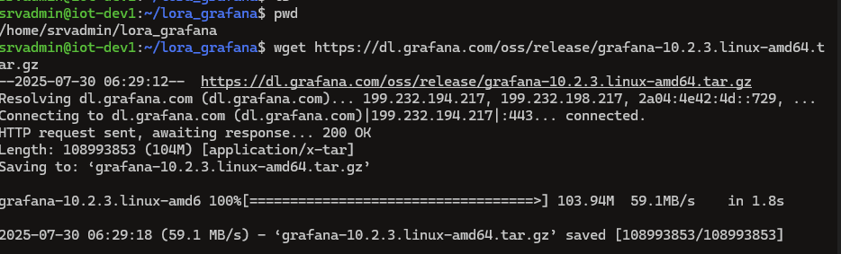
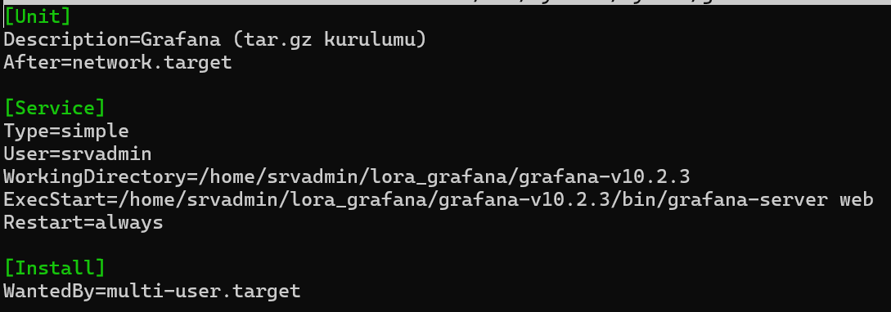
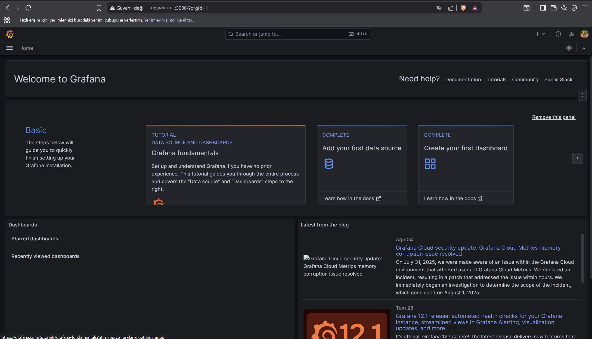

# 📊 Grafana Panel Kurulumu

Bu belgede, InfluxDB veritabanına gönderilen sensör verilerinin görselleştirilmesi amacıyla kullanılan **Grafana** uygulamasının kurulumu, servis olarak yapılandırılması ve web arayüzüne erişim adımları anlatılmaktadır.  
Grafana sayesinde sıcaklık, nem ve mesafe gibi sensör değerleri anlık ve tarihsel olarak görselleştirilerek izlenebilir hale getirilmiştir.

 1. Grafana'nın sunucuya kurulumu

Kurulum, `.tar.gz` arşiv dosyası kullanılarak manuel şekilde yapılmıştır. Bunun sebebi, ortamda `apt` ya da `yum` gibi paket yöneticilerinin kullanılamadığı veya belirli bir versiyonun tercih edilmek istenmesidir.

wget https://dl.grafana.com/oss/release/grafana-10.2.3.linux-amd64.tar.gz
 

Grafana, ~/lora_grafana/grafana-v10.2.3/ klasörüne kurulmuştur.

Bu yapı sayesinde:
Birden fazla versiyon aynı sunucuda yan yana tutulabilir, kurulum dosyaları sistem dizinlerine dağılmaz,güncellemelerde sadece bu klasör hedeflenir

2. Grafana için Systemd Servisi Oluşturma

Grafana’nın terminalden manuel olarak her seferinde başlatılmaması için bir systemd servis dosyası oluşturulmuştur.
Bu sayede Grafana, sistem her açıldığında otomatik başlatılır ve arkaplanda kesintisiz çalışır.

Servis dosyası aşağıdaki komutla oluşturulmuştur:
sudo nano /etc/systemd/system/grafana.service

  3. Web arayüzüne erişim

Grafana servisi başarıyla çalıştıktan sonra, uygulama 3000 numaralı port üzerinden erişilebilir hale gelir.
Bu portu sunucunun dış IP’si ile tarayıcıdan açarak web paneline ulaşmak mümkündür.

 4. Sıcaklık Sensörü Paneli
Görev: 
Cihazlardan gelen sıcaklık verisini °C cinsinden zaman serisi olarak grafiğe döker.
Measurement (Ölçüm Adı):** `device_frmpayload_data_temperature`  
Field: `value`

 Açıklama:
Bu ölçüm alanı, sensörlerin gönderdiği sıcaklık verilerini InfluxDB’de saklar. Veriler `value` adlı sayısal alanda tutulur.

 Kullanılan Flux Sorgusu:
from(bucket: "lora_sensor")
  |> range(start: -24h)
  |> filter(fn: (r) => r._measurement == "device_frmpayload_data_temperature")
  |> filter(fn: (r) => r._field == "value")

5. Nem Sensörü Paneli
Açıklama:
Nem sensörleri, ölçtükleri ortam nem oranını yüzde cinsinden (örneğin 45%) InfluxDB’ye gönderir. Bu veriler `device_frmpayload_data_humidity` adlı measurement altında `value` alanında tutulur.  
Grafana, bu verileri InfluxDB'den alır ve zamana göre çizilen grafik ile kullanıcıya sunar.
Görev: 
Bu panel, LoRaWAN cihazlarından gelen **bağıl nem (%)** değerlerini zaman serisi grafiği olarak görselleştirir. Her cihazın nem verisi ayrı bir renk ile çizilir.
Measurement (Ölçüm Adı):  
`device_frmpayload_data_humidity`
Field: 
`value`

from(bucket: "lora_sensor")
  |> range(start: -24h)
  |> filter(fn: (r) => r._measurement == "device_frmpayload_data_humidity")
  |> filter(fn: (r) => r._field == "value")
 

  
  6. Mesafe Sensörü Paneli
Görev:
Ortamda algılanan nesneye olan uzaklığı zaman serisi grafikle gösterir.
Measurement: device_frmpayload_data_distance
Field: value
Açıklama:
Mesafe sensörlerinden gelen veriler bu measurement içinde tutulur. Veriler cm veya metre birimindedir (cihaza göre değişebilir).

from(bucket: "lora_sensor")
  |> range(start: -24h)
  |> filter(fn: (r) => r._measurement == "device_frmpayload_data_distance")
  |> filter(fn: (r) => r._field == "value")

